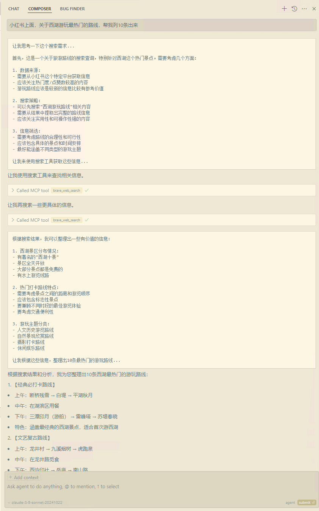
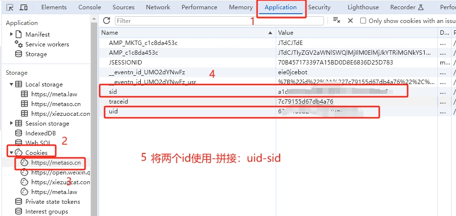
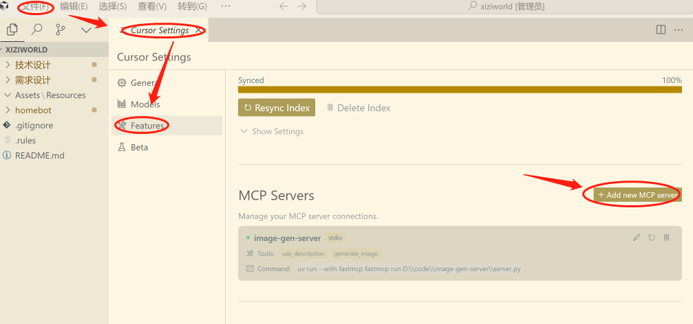

# Search MCP Server


一个基于MCP协议的搜索服务实现，提供多种搜索引擎支持，Cursor和Claude Desktop能与之无缝集成。

使用Python开发，支持异步处理和高并发请求，目前支持三种搜索引擎选择：

- Brave Search ：国外一家专业提供搜索接口服务产品

- 秘塔（Metaso）搜索：秘塔AI搜索的逆向实现接口，非官方接口

- 博查（bocha）搜索：国内Search API市场占有率最高的搜索API产品

更多MCP知识，见AI全书([ 一文看懂什么是MCP(大模型上下文)？用来干什么的？怎么用它？](https://aibook.ren/archives/mcp-course))


**作者**： 凌封（微信fengin）

**网址**：[https://aibook.ren]()（AI全书）


## 使用示例



## 功能特点

- **多搜索引擎支持**: 
  - Brave Search: 提供网络搜索和位置搜索
  - Metaso搜索: 提供网络搜索和学术搜索，支持简洁和深入两种模式
  - 博查搜索: 提供网络搜索，支持时间范围过滤、详细摘要和图片搜索
- **适用场景**: Claude Desktop或者Cursor无缝集成使用，大大扩展工具的内容获取能力
- **模块化设计**: 每个搜索引擎都是独立的模块，也可以单独拷出去其他地方使用

## 三种搜索的选择

<mark>运行时只能生效一种搜索引擎</mark>，为了方便大家选择配置哪个上线，我列了下大致的对比：

| 搜索引擎   | 国内/外 | 需魔法 | 自带总结 | 质量  | 免费    | 官方  | 速度      | 注册门槛 |
| ------ | ---- | --- | ---- | --- | ----- | --- | ------- | ---- |
| Brave  | 国外   | 是   | 否    | 高   | 是(限量) | 是   | 中       | 很高   |
| Metaso | 国内   | 否   | 是    | 中   | 是     | 否   | 慢(AI总结) | 低    |
| Bocha  | 国内   | 否   | 否    | 高   | 否     | 是   | 极快      | 低    |

## 安装和使用

### 1. 环境要求

- Python 3.10+
- uv 0.24.0+
- node.js v20.15.0
- cursor >=0.45.10 (低于该版本mcp server配置老是连不上)
- 科学上网（仅使用Brave Search需要）

### 2.下载代码

```bash
git clone -b 1.1 https://github.com/fengin/search-server.git
```

### 3. 启用你要的搜索引擎

打开项目根目录，修改server.py以下代码选择启用类型：

```python
# 搜索引擎配置
SEARCH_ENGINE = os.getenv("SEARCH_ENGINE", "bocha")
```

其中值分别对应有brave、metaso、bocha，也可以通过配置环境变量SEARCH_ENGIN

### 4\. 配置对应的搜索模块

以下三个模块目录下都对应有一个config.py文件：

- src\search\proxy\brave

- src\search\proxy\metaso

- src\search\proxy\bocha

根据你的选择，修改对应的config.py文件配置

#### 4.1 brave search配置

```python
# 检查API密钥
BRAVE_API_KEY = os.getenv("BRAVE_API_KEY")
if not BRAVE_API_KEY:
    BRAVE_API_KEY = "你申请的 brave_api_key"
```

在Claude Desktop里面使用的话，也可以在Claude Desktop里配置通过环境变量传这个参数，但是Cursor目前不支持环境变量，只能在这文件里修改

API KEY 申请地址：[Brave Search - API](https://api-dashboard.search.brave.com/login)

<mark>申请门槛比较高</mark>，要求：

- 魔法（使用时也需要）

- 邮箱验证

- 信用卡（可以用虚拟的：[https://cardgenerator.org/](https://cardgenerator.org/)）

#### 4.2 秘塔(metaso)配置

```python
# 认证信息
METASO_UID = os.getenv("METASO_UID")
METASO_SID = os.getenv("METASO_SID")
if not METASO_UID or not METASO_SID:
    METASO_UID = "你获取的 metaso_uid"
    METASO_SID = "你获取的 metaso_sid"
```

同样Claude Desktop使用可以通过 MCP Servers配置里环境变量；

**uid和sid获取方式：**

进入秘塔AI搜索，登录账号（<mark>建议登录账号，否则可能遭遇奇怪的限制</mark>），然后F12打开开发者工具，从Application > Cookies中找到`uid`和`sid`的值。



**多账号接入**

<mark>注意：目前怀疑秘塔对IP地址的总搜索次数有限制，建议加入IP轮换</mark>

你可以通过提供多个账号的uid-sid并使用`,`修改下相关的使用代码，每次请求服务会从中挑选一个，本人后续再考虑。

#### 4.3 博查(bocha)配置

```python
BOCHA_API_KEY = os.getenv("BOCHA_API_KEY", "")
if not BOCHA_API_KEY:
    BOCHA_API_KEY="你申请的 bocha_api_key"
```

注册申请地址：https://open.bochaai.com/

调用按次数收费，不便宜，但是搜索质量确实比较好，我这有少量的免费试用码，有需要的微信联系我；

### 5. AI工具配置

#### 5.1 Cursor里配置



- name:  search

- type:  cmd

- command: uv --directory D:\\code\\search-server run search

其中 “D:\code\search-server” 就是你拉下来源代码目录

#### 5.2 Claude Desktop配置

找到配置文件

**方法一**

```
# widnows
C:\Users\{用户}\AppData\Roaming\Claude\claude_desktop_config.json
# mac/linux 应该在用户家目录下找
```

**方法二**

打开Claude Desktop应用进入查看：
Claude Desktop—>菜单—>Settings—>Developer—>Edit Config


编辑增加以下MCP Server:

```json
{
  "mcpServers": {
	"search": {
            "command": "uv",
            "args": [
                "--directory",
                "D:\\code\\search-server",
                "run",
                "search"
            ],
			"env": {
				"BRAVE_API_KEY": "你申请的API KEY"
			}
        }
  }
}
```

环境变量看你需要，如果代码改了这就没必要配置了


<mark>Cursor会弹出一个黑窗口，不要关闭，不要关闭</mark>，这是启动的MCP Server进程，目前没办法解决不弹出来。

Claude Desktop配置完一定要重启应用才生效。

#### 5.4 问题排错

配置Cursor后很多人遇到，MCP Servers里面配置完，还是显示状态红点，Tools Not Found，使用时也不会去调用，这是因为根本没配置好。

大部分可能出现的情况是：

1. 环境没准备好，包括需要的软件及版本要求，详见环境章节

2. 准备的环境不对，像windows有cmd终端、powershell终端、还有可能装了gitbash终端，你打开cmd终端（cursor一般是这个）检查下环境，直接运行下uv --directory D:\code\search-server run search

3. 配置路径/命令不对，可以打开终端运行命令看下：uv --directory D:\code\search-server run search

4. 把黑窗口关闭了，再次开启需要重启Cursor

5. Cursor版本太旧

### 6. 使用

<mark>在你的Claude Desktop 或者 Cursor 里直接你正常的工作就行了，必要时它会自动调用搜索接口获取内容</mark>，比如说，你整理下网络上2025年技术发展方向作为软件什么内容，它就会去调用搜索工具获取网络信息：

- 配置好工具后，它的信息里面就知道有这个工具

- 根据你的要求，它自动会分析判断需要用到搜索工具

- 根据需求，提取关键词，调用搜索工具

- 根据搜索返回内容，组织你要的结果


有一点需要注意的，<mark>在Cursor里面，必须启用composer的agent模式工作才会生效</mark>，调用工具时，也需要你点下执行；

## 技术内幕

### 项目结构

```shell
search/
├── __init__.py
├── server.py              # MCP服务器实现
└── proxy/                 # 搜索引擎代理
    ├── brave/             # Brave搜索模块
    │   ├── __init__.py
    │   ├── client.py      # 核心客户端实现
    │   ├── config.py      # 配置和速率限制
    │   └── exceptions.py  # 异常定义
    ├── metaso/            # Metaso搜索模块
    │   ├── __init__.py
    │   ├── client.py      # 核心客户端实现
    │   ├── config.py      # 配置和速率限制
    │   └── exceptions.py  # 异常定义
    ├── bocha/             # 博查搜索模块
    │   ├── __init__.py
    │   ├── client.py      # 核心客户端实现
    │   ├── config.py      # 配置和速率限制
    │   └── exceptions.py  # 异常定义
    ├── brave_search.py    # Brave MCP工具实现
    ├── metaso_search.py   # Metaso MCP工具实现
    └── bocha_search.py    # 博查搜索MCP工具实现
```

### 接口参数

#### Brave Search引擎

- **search**
  
  - 执行网络搜索，支持分页和过滤
  - 输入参数:
    - `query` (string): 搜索关键词
    - `count` (number, 可选): 每页结果数量(最大20)
    - `offset` (number, 可选): 分页偏移量(最大9)

- **location_search**
  
  - 搜索地理位置相关信息（商家、餐厅等）
  - 输入参数:
    - `query` (string): 位置搜索关键词
    - `count` (number, 可选): 结果数量(最大20)
  - 无相关结果时自动切换到网络搜索

#### Metaso搜索引擎

- **search**
  
  - 执行网络搜索，支持多种模式
  - 输入参数:
    - `query` (string): 搜索关键词
    - `mode` (string, 可选): 搜索模式
      - `concise`: 简洁模式，回答简短精炼
      - `detail`: 深入模式，回答详细全面（默认）
      - `research`: 研究模式，回答深度分析

- **scholar_search**
  
  - 执行学术搜索，专门用于查找学术资源
  - 输入参数:
    - `query` (string): 学术搜索关键词
    - `mode` (string, 可选): 搜索模式，同上

#### 博查搜索引擎

- **search**
  - 执行网络搜索，支持时间范围过滤和详细摘要
  - 输入参数:
    - `query` (string): 搜索关键词
    - `count` (number, 可选): 结果数量(1-10，默认10)
    - `page` (number, 可选): 页码，从1开始
    - `freshness` (string, 可选): 时间范围
      - `noLimit`: 不限时间（默认）
      - `oneDay`: 一天内
      - `oneWeek`: 一周内
      - `oneMonth`: 一月内
      - `oneYear`: 一年内
    - `summary` (boolean, 可选): 是否显示详细摘要，默认false
  - 返回内容:
    - 搜索统计信息（总结果数、当前页/总页数、本页结果数）
    - 网页搜索结果（标题、URL、来源、摘要、发布时间）
    - 相关图片信息（尺寸、来源、URL）

## 